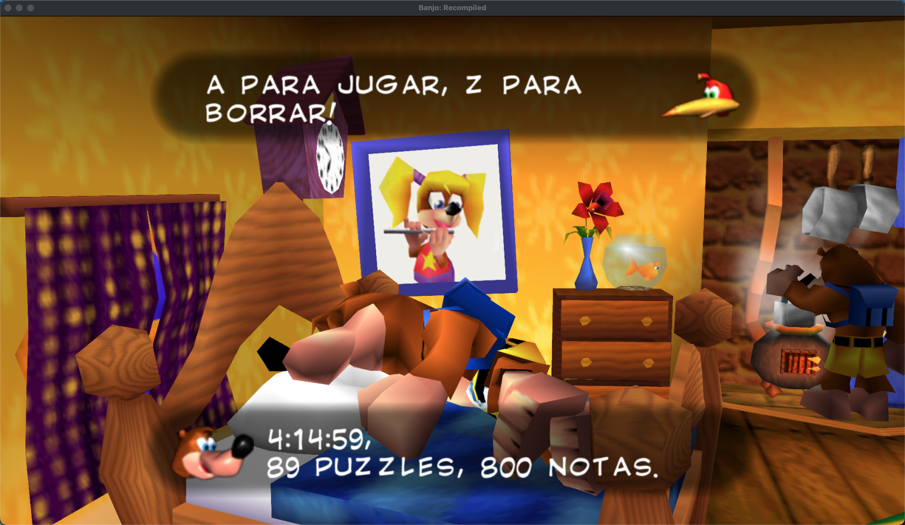
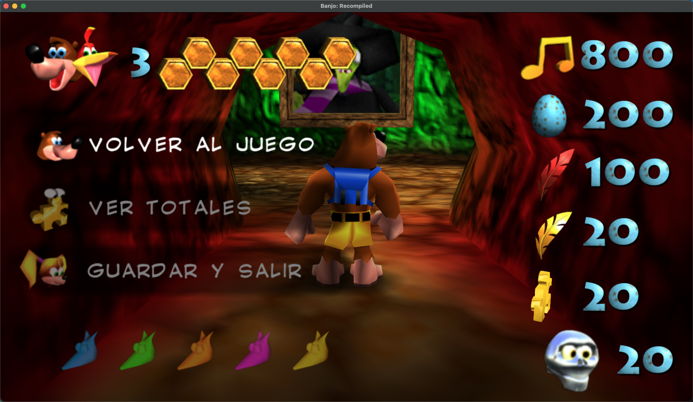
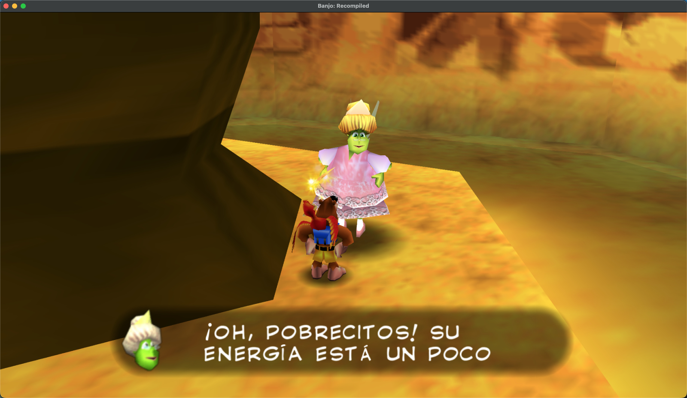
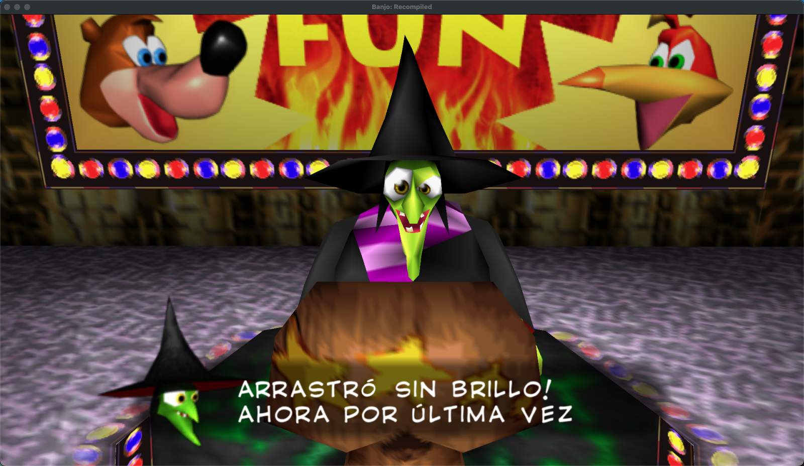
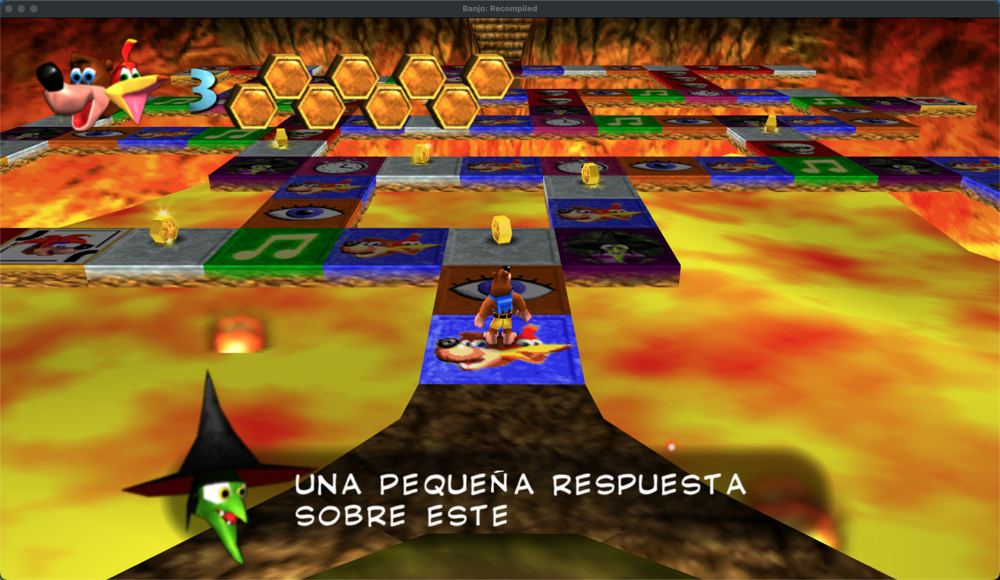

# BK Spanish / Espanol

Mod de traduccion completa al espanol latino para **Banjo-Kazooie: Recompiled**.

  

## Capturas







## Contenido

### Dialogos traducidos (913+ assets)
- **9 mundos completos**: Montana Espiral, Montana de Mumbo, Cala del Tesoro, Caverna de Clanker, Pantano Bubblegloop, Pico Freezeezy, Valle de Gobi, Mansion Monstruosa, Bahia Oxidada, Bosque del Reloj
- **Gruntilda's Lair**: puertas de puzzles, puertas de notas, Dingpot, Brentilda (30 gossips), Cheato (3 encuentros + activaciones)
- **Quiz Furnace Fun**: 200 preguntas/respuestas en formato raw (texto, imagen, sonido, Grunty personal)
- **Batalla final**: taunts de Grunty, fases Jinjo/Jinjonator
- **Cutscenes**: intro, endings buenos/malos, desfile de creditos
- **NPCs**: todos los personajes con su tono original (Kazooie vulgar, Gruntilda en rima, Mumbo primitivo)
- **Coleccionables**: Jiggy, notas, panales, plumas, Jinjos, craneos
- **32 taunts aleatorios** de Gruntilda (todos en rima)
- **Bottles Bonus**: puzzles y codigos

### Menus traducidos
- Menu de pausa (Volver al juego, Ver totales, Guardar y salir)
- Seleccion de partida (instrucciones, confirmaciones)
- Nombres de niveles en totales
- Texto dinamico de info de partida (PARTIDA X: TIEMPO/VACIA)

### Caracteres especiales
Soporte nativo de caracteres espanoles sin dependencias externas:
- **Vocales acentuadas**: A E I O U con tildes visibles
- **Ene**: N con tilde ondulada
- **Signos invertidos**: ? y ! de apertura (rotacion 180)
- Glifos generados en runtime via inyeccion CI8

### Compatibilidad HD
Incluye texture pack (.rtz) para compatibilidad con **BK Reloaded** (HD textures):
- 8 glifos HD en PNG (A E I O U N ? !)
- Hashes rt64 para matching automatico
- Tamano y posicion ajustados para coincidir con el font HD

## Instalacion

### Requisitos
- Banjo-Kazooie: Recompiled v1.0.1+
- Asset Expansion Pak v0.0.3+ (dependencia obligatoria)
- macOS: requiere Rosetta (`arch -x86_64`)

### Archivos
1. **`bk_spanish_translation.nrm`** - Mod principal (dialogos + glifos)
2. **`bk-spanish-fonts-hd.rtz`** - Texturas HD de glifos (opcional, solo si usas BK Reloaded)

### Pasos
1. Copia `bk_spanish_translation.nrm` a la carpeta de mods:
   - **Windows**: `%APPDATA%/BanjoRecompiled/mods/`
   - **macOS**: `~/Library/Application Support/BanjoRecompiled/mods/`
2. (Opcional) Copia `bk-spanish-fonts-hd.rtz` a la misma carpeta
3. Activa el mod en el menu de Mods del juego
4. Asegurate de tener **Asset Expansion Pak** activo

### Mods compatibles
- **BK Reloaded** (HD textures) - compatible con .rtz
- **Asset Expansion Pak** - requerido
- **font_plus_latin_1** - NO compatible (conflicto con nombres de niveles en totales)

## Compilacion

### Requisitos de build
- LLVM/Clang 18 (target MIPS)
- N64Recomp mod tools (RecompModTool)
- Python 3 con PIL/Pillow (para generacion de glifos HD)

### Build
```bash
# macOS con Homebrew
CC=/opt/homebrew/Cellar/llvm@18/18.1.8/bin/clang \
LD=/opt/homebrew/Cellar/llvm@18/18.1.8/bin/ld.lld \
make

# Empaquetar
RecompModTool mod.toml .
```

### Estructura del proyecto
```
BKSpanish/
|-- src/
|   |-- main.c                    # Inicializacion, hooks, inyeccion de glifos
|   |-- translation_builder.c     # Builder de binarios de dialogo
|   |-- strhelper.c               # Utilidades de strings
|   +-- translations/
|       |-- sm.c                  # Montana Espiral (46 assets)
|       |-- mm.c                  # Montana de Mumbo (28 assets)
|       |-- ttc.c                 # Cala del Tesoro (31 assets)
|       |-- cc.c                  # Caverna de Clanker (14 assets)
|       |-- bgs.c                 # Pantano Bubblegloop (~25 assets)
|       |-- fp.c                  # Pico Freezeezy (~45 assets)
|       |-- gv.c                  # Valle de Gobi (28 assets)
|       |-- mmm.c                 # Mansion Monstruosa (16 assets)
|       |-- rbb.c                 # Bahia Oxidada (9 assets)
|       |-- ccw.c                 # Bosque del Reloj (35 assets)
|       |-- core.c                # Coleccionables y generico (28 assets)
|       |-- lair.c                # Guarida de Gruntilda (39 assets)
|       |-- mumbo.c               # Mumbo generico (18 assets)
|       |-- brentilda.c           # Brentilda gossips (32 assets)
|       |-- taunts.c              # Grunty taunts aleatorios (32 assets)
|       |-- misc.c                # Mr. Vile, Bottles Bonus, etc (48 assets)
|       |-- parade.c              # Cutscenes intro/ending (60 assets)
|       |-- puzzleboard.c         # Quiz board Furnace Fun (34 assets)
|       |-- quiz1.c               # Batalla final (105 assets)
|       |-- quiz2.c               # Preguntas de mundos (105 assets)
|       |-- quiz3.c               # Preguntas Brentilda/sonido (107 assets)
|       +-- quiz_raw.c            # Quiz raw binary (200 assets)
|-- include/
|   |-- translation.h             # Tipos y tablas
|   |-- strhelper.h               # Helpers de strings
|   +-- spanish_glyphs.h          # Datos de glifos CI8
|-- fonts/                        # PNGs HD para texture pack
|   |-- A_acute.png
|   |-- E_acute.png
|   |-- I_acute.png
|   |-- N_tilde.png
|   |-- O_acute.png
|   |-- U_acute.png
|   |-- excl_inv.png
|   +-- quest_inv.png
|-- rt64.json                     # Mapeo de hashes HD
|-- mod.toml                      # Configuracion del mod
+-- tools/
    +-- gen_spanish_glyphs.py     # Generador de glifos
```

## Arquitectura tecnica

### Sistema de traduccion
- **DialogLine/DialogDef**: estructura C para definir dialogos (portrait + texto)
- **translation_builder**: genera binarios compatibles con el formato del juego en runtime
- **AEP (Asset Expansion Pak)**: reemplaza assets del juego con nuestras traducciones
- **Quiz raw**: assets del quiz en formato binario exacto (estructura alemana preservada)

### Inyeccion de glifos
- Remapeo Latin-1 a posiciones no usadas del font (#, $, &, *, +, [, \, ])
- Copia de glifos base (A, E, I, O, U, N, !, ?) con modificacion de pixeles CI8
- Acentos dibujados en runtime sobre los glifos copiados
- Signos invertidos via rotacion 180 de los pixeles
- Hook en `func_802F51B8` (font init) para inyeccion

### Orden de registro AEP
- `_with_size` se llama PRIMERO (quiz raw assets)
- `_register_replacement` se llama DESPUES (dialog assets)
- Este orden evita corrupcion de la tabla interna de AEP

## Historial de versiones

### v3.1
- I con tilde visible y hash HD completo
- Signos ? y ! de apertura escalados y con hash HD
- 8/8 glifos HD completos

### v3.0
- Quiz Furnace Fun completo en espanol (200 raw assets)
- Consistencia Brentilda-Quiz (75 respuestas sincronizadas)
- Nombres de mundos traducidos en quiz y dialogos
- Rotacion 180 del signo de interrogacion de apertura

### v2.1
- Texturas HD para glifos acentuados (compatible con BK Reloaded)
- 6 de 8 glifos HD iniciales

### v2.0
- Tildes visibles (A E I O U N) dibujadas en CI8
- Signos invertidos (? !)
- Sin dependencia de font_plus_latin_1

### v1.0
- 913+ assets de dialogo traducidos
- 9 mundos + Lair + Quiz + Cutscenes + Menus
- Sistema de builder para formato de dialogo y quiz

## Creditos

- **wilrojasdev** - Traduccion, edicion de glifos HD
- **Claude (Anthropic)** - Arquitectura del mod, builder, inyeccion de glifos
- **V10lator** - Mod aleman (referencia de estructura binaria)
- **Dario** - Asset Expansion Pak
- **GhostlyDark** - BK Reloaded HD pack (referencia)
- **Krisp** - Font Plus Latin-1 (referencia)

## Licencia

Este proyecto es un mod fan-made para Banjo-Kazooie: Recompiled.
Banjo-Kazooie es propiedad de Rare/Microsoft.
